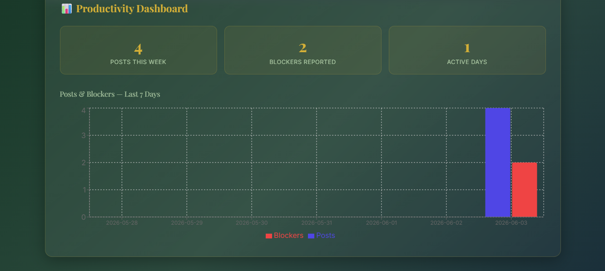

# 🚀 Team Standup Logger

A lightweight internal productivity tool where team members post daily standup updates asynchronously, with a live activity feed and productivity dashboard.

Built for Konvergenz Network Solutions Limited — Software Engineer Internship Assignment.

---

## 📸 Dashboard Screenshot



---

## 🛠️ Tech Stack

- **Backend:** Python, Django, Django REST Framework
- **Frontend:** React, Recharts, Axios
- **Database:** SQLite
- **Weather API:** Open-Meteo (free, no API key needed)

---

## ⚙️ Backend Setup

### Requirements
- Python 3.10+
- pip

### Steps

```bash
# 1. Navigate to backend folder
cd standup-logger/backend

# 2. Create and activate virtual environment
python -m venv venv
venv\Scripts\activate        # Windows
source venv/bin/activate     # Mac/Linux

# 3. Install dependencies
pip install django==5.1.9 djangorestframework django-cors-headers pillow

# 4. Run migrations
python manage.py migrate

# 5. Start the server
python manage.py runserver
```

Backend runs at: `http://127.0.0.1:8000`

---

## 🎨 Frontend Setup

### Requirements
- Node.js 18+
- npm

### Steps

```bash
# 1. Navigate to frontend folder
cd standup-logger/frontend

# 2. Install dependencies
npm install

# 3. Start the app
npm start
```

Frontend runs at: `http://localhost:3000`

---

## 📡 API Endpoints

| Method | Endpoint | Description |
|--------|----------|-------------|
| GET | `/api/standups/` | Fetch all standup posts |
| POST | `/api/standups/` | Submit a new standup post |
| GET | `/api/standups/stats/` | Get posts & blockers for last 7 days |

---

## ✨ Features

- **Standup Form** — Post yesterday, today, blockers with file attachment
- **Live Feed** — Auto-refreshes every 10 seconds, no page reload
- **Blocker Badge** — Posts flagged as blockers are highlighted in red
- **Weather Widget** — Shows live Nairobi weather via Open-Meteo
- **Dashboard** — Bar chart showing posts and blockers for the last 7 days
- **Stats Cards** — Total posts, blockers and active days this week

---

## 🌐 Live Demo

[Click here to view the live app](https://moonlit-treacle-e68904.netlify.app)